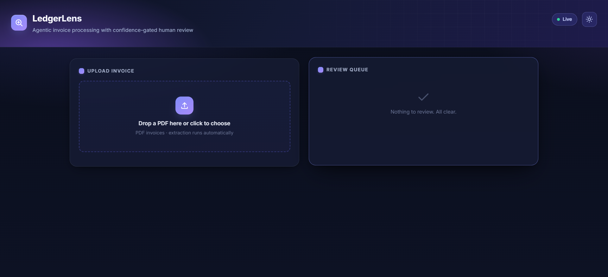
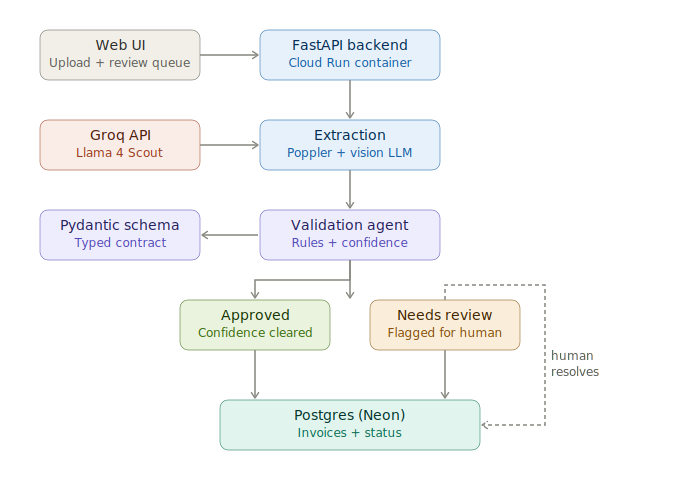
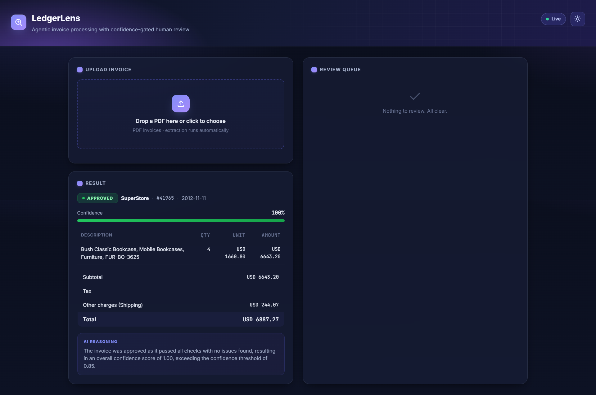
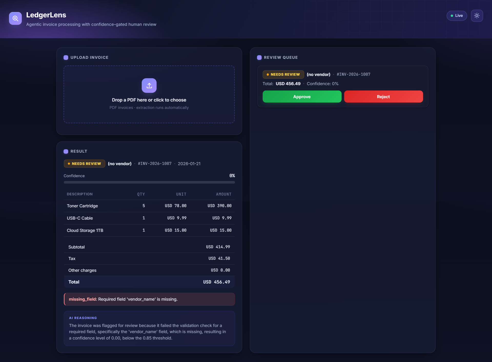

# LedgerLens

> Agentic invoice processing with confidence-gated human review.

**Live demo:** https://ledgerlens-223615207409.us-central1.run.app

LedgerLens ingests a PDF invoice, extracts structured fields with a vision LLM, runs an agentic validation pass (math reconciliation, duplicate detection, missing-field and sanity checks), and routes the result: high-confidence clean invoices are auto-approved into Postgres, while low-confidence or rule-failing invoices are flagged into a human-review queue surfaced in a web UI.



## Problem

Accounts-payable teams manually key invoice data and eyeball it for errors — slow, repetitive, and error-prone. Full automation is risky because extraction is imperfect and a wrong number can mean a wrong payment. LedgerLens automates the clean, confident cases and escalates only the uncertain ones to a human, so people spend their attention where it actually matters.

## Architecture



A PDF is uploaded through the UI to a FastAPI backend. Poppler rasterizes the page, a vision LLM (Llama 4 Scout via Groq) extracts fields into a typed Pydantic schema with per-field confidence, and a validation agent applies deterministic rules. The routing decision combines rule outcomes with a confidence gate: clean and confident invoices are auto-approved; anything with an error, a warning, or sub-threshold confidence is flagged for human review. All results persist to Postgres, and a human resolves flagged items from the queue.

## Results

Measured by `evals/run_eval.py` on 8 synthetic invoices with known-correct ground truth (the generator produces both the PDFs and the truth values, so accuracy is exact):

- **Field-level extraction accuracy: 97.2%** (70/72 scalar fields across vendor, invoice number, date, currency, subtotal, tax, other charges, total, and line-item count)
- **Routing accuracy: 100%** (8/8 invoices routed to the correct status — clean invoices auto-approved, deliberately broken ones flagged for review)

The two "missed" fields are blank fields on deliberately-corrupted invoices, which the model correctly reported as absent — the very reason those invoices route to review. All metrics are on synthetic test data, not a real-world benchmark.





## Tech stack

- **Extraction:** Llama 4 Scout (vision) via Groq, behind a provider-agnostic OpenAI-compatible client (swappable to OpenAI or Gemini by config)
- **Schema & validation:** Pydantic 2
- **Backend:** FastAPI
- **Database:** Postgres (SQLAlchemy ORM); Neon in production, Dockerized Postgres locally
- **PDF rasterization:** Poppler via pdf2image
- **Infrastructure:** Docker, Google Cloud Run
- **Evaluation:** custom field-accuracy + routing-accuracy script over a synthetic, reproducible test set

## Setup

```bash
# 1. Clone and enter
git clone https://github.com/hamzawithpython/ledgerlens.git
cd ledgerlens

# 2. Create a virtual environment (Python 3.11+)
python -m venv venv
source venv/bin/activate        # Windows: .\venv\Scripts\Activate.ps1

# 3. Install dependencies
pip install -r requirements.txt
# Also install Poppler: `apt-get install poppler-utils` (Linux),
# `brew install poppler` (macOS), or the poppler-windows release on PATH.

# 4. Configure environment
cp .env.example .env            # then fill in GROQ_API_KEY and DATABASE_URL

# 5. Start Postgres (local) and create tables
docker compose up -d db
python -c "from app.db import Base, engine; import app.models; Base.metadata.create_all(engine)"

# 6. Generate synthetic test invoices
python evals/generate_invoices.py

# 7. Run
uvicorn app.main:app --reload --port 8000
# open http://localhost:8000

# Tests and evaluation
pytest tests/ -v
python -m evals.run_eval
```

## Technical decisions

**Vision LLM over a PDF parser.** Invoice layouts vary wildly. A vision model handles arbitrary layouts and emits structured fields plus per-field confidence in one call, where a text parser would still need an LLM bolted on top for structure. One model, one schema, native confidence.

**Rules drive routing; the LLM only narrates.** Model self-reported confidence turned out poorly calibrated (Llama 4 Scout returns ~1.0 on nearly everything), so deterministic rules — math reconciliation, duplicate detection, missing-field and sanity checks — are the primary routing gate. Confidence is a secondary backstop. The LLM generates the human-readable reasoning summary for the review UI but makes no routing decision.

**Reconcile the math instead of modeling every field.** Real invoices carry charges that can't be enumerated in advance (shipping, handling, discounts, deposits). Rather than name each one, all non-tax adjustments go into a single `other_charges` bucket and the system enforces `subtotal + tax + other_charges = total`. When the arithmetic doesn't close, an unaccounted charge wasn't extracted, and the invoice routes to review — so silent extraction gaps surface as reconciliation failures rather than bad data.

**Provider-agnostic by design.** Extraction goes through a thin OpenAI-compatible abstraction, so the model and provider are config, not code. This paid off mid-build when Groq decommissioned the model originally used — the swap was a one-line change.

## What didn't work / lessons

- **LLM self-reported confidence is poorly calibrated** (Llama 4 Scout returns ~1.0 on nearly everything). Rule-based validation is the primary routing gate; model confidence is a secondary signal, with missing fields forced to 0.
- **Provider-agnostic design earned its keep.** Groq decommissioned the Llama 3.2 vision models mid-build; because extraction runs through a thin provider abstraction over the OpenAI-compatible API, swapping to Llama 4 Scout was a one-line config change with zero code edits.
- **The lockfile must match the working environment.** An SDK incompatibility (`httpx` removing a kwarg the pinned `openai` SDK passed) was fixed locally but resurfaced in the Docker image, because the fix lived in the local venv while `requirements.txt` still carried the old pin. The container builds only from the lockfile — "works on my machine" meant nothing until the pins were synced.
- **Open-weight vision models return inconsistent JSON shapes across calls.** Scout emitted line-item fields both flat and nested for different invoices. Rather than fight it with prompt tweaks, the extraction layer normalizes any shape into the schema's expected form before Pydantic validation.
- **The model launders document errors.** Given an invoice with a deliberately wrong total — and even a wrong line-item amount — Scout silently returned arithmetically *consistent* numbers, masking the discrepancy. This is precisely why validation runs on deterministic rules, and why review routing is tested with missing-field corruptions (which the model reports faithfully) rather than numeric ones (which it repairs).
- **Reconciliation catches missing charges, not misread ones.** A sanity rule flags charges exceeding the subtotal (rare on a real invoice) as a warning routed to review, closing part of that gap. The remaining case — a misread that stays plausible — is a documented limitation a production system would address with line-text cross-validation or a second-model check.
- **Test your test data.** Low extraction scores initially looked like a model limitation, but inspecting the actual PDF revealed a layout collision in the synthetic-invoice generator — the shipping and total lines were rendered on top of each other, and the model "misread" the smear. The fix was in the generator, not the model. When eval numbers look bad, verify the input before blaming the model.
- **Secrets with special characters break CLI env-var flags.** The Neon connection string contains an `@`, which collided with gcloud's `--set-env-vars` delimiter and silently split the URL into two malformed variables, crashing startup. Switching to an `--env-vars-file` parsed it correctly and kept credentials out of shell history.

## Project structure

app/            FastAPI app, extraction, validation agent, storage, schemas, UI
evals/          synthetic invoice generator, ground truth, accuracy eval
tests/          unit tests for the validation rules
Dockerfile      container with Poppler for Cloud Run
docker-compose.yml   local Postgres

## Note on data

All sample invoices are synthetic, generated by `evals/generate_invoices.py` with fictional vendors. No real vendor data is included in this repository.